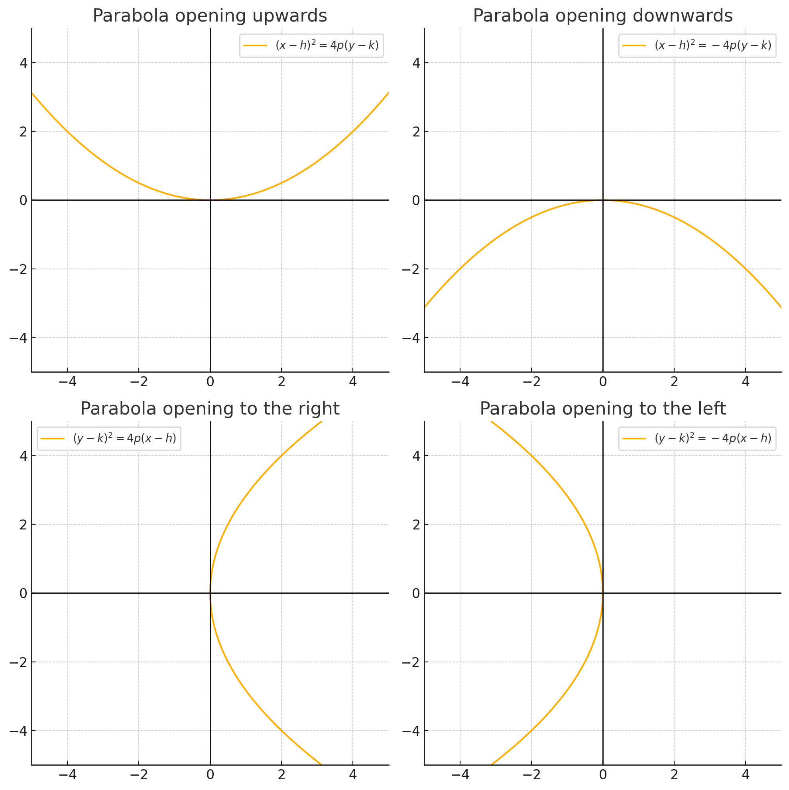
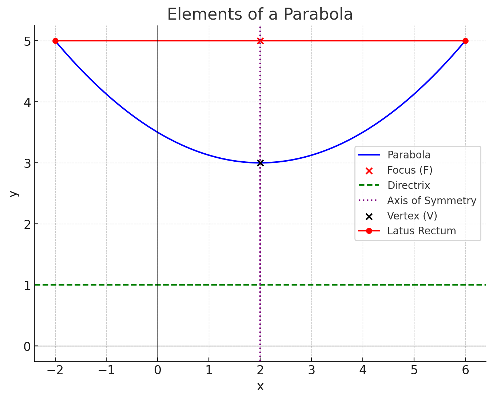

Parabola's Ecuations Review
======================================================================
Quick parabola review. This will help to understand better how to implement fortune's algorithm because, this method is based in the use of the parabola's geometry to compute the Voronoi's diagrams.

## Definition
It can be geometricaly defined by the expression:
$$d(P, F) = d(P, D)$$

Where
- $d$ is a distance between two points function that takes two points as parameters.
- $P$ can be any point.
- $F$ is the focal point.
- $D$ is a a point belonging to the directrix.

In other words, it can be defined as the set of points whose distance to a point called *Focus* is the same as its distance to a rect called *Directrix*.

## Parabola's Ecuation Structure
### General/Cuadratic
The most common way for representing a parabola:
$$y = ax^2 + bx + c$$
### Canonic
Where $(h, k)$ is the vertex of the parabola and $P$ is the distance between the *Vertext* and *Focus*:
#### Vertical
It is vertical when the symmetry axis is parallel to the Y axis in the plane.
$$(y - k)^2 = 4p(x - h)$$
__When__:
- $p > 0$: Parabola opens upwards $\uparrow$
- $p < 0$: Parabola opens downwards $\downarrow$
#### Horizontal
It is horizontal when the symmetry axis is parallel to the X axis in the plane.
$$(x - h)^2 = 4p(y - k)$$
__When__:
- $p > 0$: Parabola opens to the right $\rightarrow$
- $p < 0$: Parabola opens to the left $\leftarrow$

## Parabola's Components
### Vertex
It is the lowest point of the parabola. Is the point where the curve changes its direction. Also it is the middle point between the directrix and the focus.
### Focus
It is a fixed point inside the parabola. The parabola is defined such as that any parabola's point is at the same distance from the focus than from the directrix.
### Directrix
It is a straight line outside the parabola and it is perpendicular to the symmetry axis.
### Symmetry axis
It is a straight line that passes through the vertex and focus, dividing the parabola in two symmetryc parts.
### Latus rectum
A straight line segment perpendicular to the symmetry axis and that passes through the focus. Its lenght is defined as $4p$, where $p$ is the distance from the vertex to the focus.
### Radius vector
The distance from any given parabola's point to the focus.

## BeachLine Ecuation
Each beachline in Fortune's algorithm is defined with the following ecuation:
$$ y = \frac{(x-p)^2}{2(q-d)} + \frac{q+d}{2}$$

__Where:__
- $(p, q)$ is a *Site* (parabola's focus).
- $y = d$ is the *sweep line* (directrix).
- $(x, y)$ are points of the parabola.

### Demonstration
By the [parabola's definition](#definition), we get that a parabola is the set of equidistant points from a fixed point (*focus* $(p, q)$) and a straight line (*directrix* $y = d$). So, for each parabola's point $(x, y)$ we get that:
$$DistanceToFocus = DistanceToDirectrix$$
#### Distance to Focus $(p, q)$
We use the euclidean distance ecuation:
$$\sqrt[2]{(x-p)^2 + (y-q)^2}$$
#### Distance to Directrix $y = d$
A point $(x, y)$ has a vertical distance to the *Directrix* given by:
$$|y-d|$$
#### Parabola's Definition
With the previous definitions we can rewrite our parabola's ecuation in the following way:
$$\sqrt[2]{(x-p)^2 + (y-q)^2} = |y-d|$$
#### Develop the Ecuation
Now, we just need to get an $f(x)$ formula expression from the recient parabola's definition
$$\sqrt[2]{(x-p)^2 + (y-q)^2} = |y-d|$$
$$(x-p)^2 + (y-q)^2 = (y-d)^2$$
$$(x-p)^2 + y^2 - 2qy + q^2 = y^2 - 2dy + d^2$$
$$(x-p)^2 - 2qy + q^2 = -2dy + d^2$$
$$(x-p)^2 + q^2 - d^2 = 2y(q-d)$$
$$y = \frac {(x-p)^2 + q^2 - d^2} {2(q-d)}$$
$$y = \frac {(x-p)^2 + (q+d)(q-d)} {2(q-d)}$$
$$ y = \frac{(x-p)^2}{2(q-d)} + \frac{q+d}{2}$$

## Fortune Cell's Border
A Fortune cell's border is the line that divides each cell from each other in the diagram. They appear as straight lines that define the cell's shape and borders. The border is the set of points where two parabolas intersect each other. This creates the characteristic straight line that defines the Voronoi's cells.

### Border Formal Definition
A border between two sites; $s_1(x_1, y_1)$ and $s_2(x_2, y_2)$, is the set of points equidistant to both, $s_1$ and $s_2$. In other words, is any given point $p(x, y)$ in a border satisfies the following expression:
$$Distance(p, s_1) = Distance(p, s_2)$$
__Mathematicly can be written as:__
$$\sqrt [2] {(x-x_1)^2 + (y-y_1)^2} = \sqrt [2] {(x-x_2)^2 + (y-y_2)^2}$$
__Simplifying this ecuation, we can get the following expression representing a line:__
$$x(x_1-x_2) + y(y_1-y_2) = \frac {x_1^2 + y_1^2 - x_2^2 - y_2^2} {2}